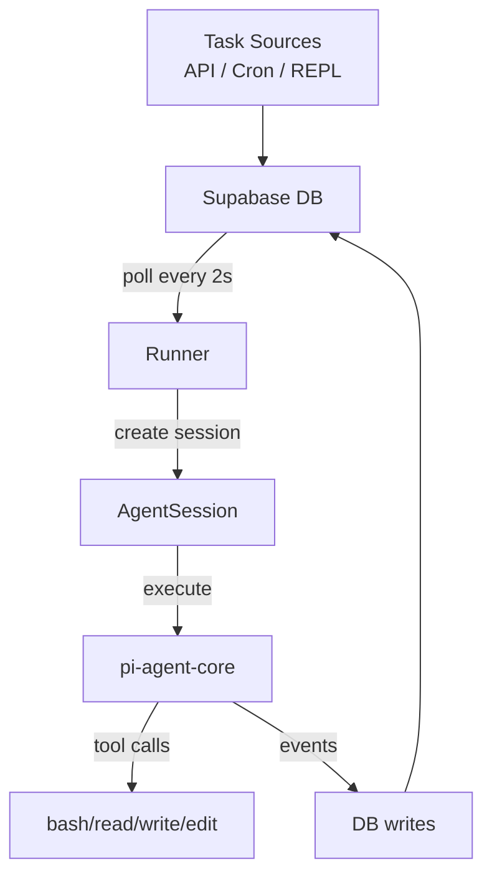
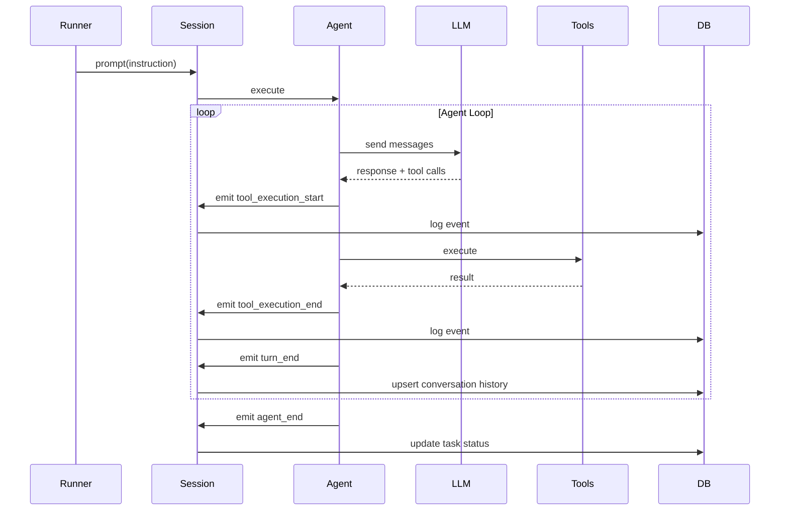

## Overview

Warden is a CLI agent that runs 24/7, executing tasks by writing and executing shell scripts. It uses **Supabase as both the task queue and persistence layer**—no external queue service needed. Tasks are inserted into the database with status `pending`, and a polling runner claims and executes them serially using `pi-agent-core` for the LLM agent loop.

<Note>
  **Key principle**: The database IS the queue. All task lifecycle state lives in Supabase.
</Note>

## High-Level Flow



<Steps>
  <Step title="Task Creation">
    A task source (API endpoint, cron job, or REPL) inserts a new row into `warden_tasks` with `status: pending`
  </Step>
  
  <Step title="Task Claiming">
    The runner polls the database every 2 seconds, finds the oldest pending task, and atomically updates its status to `running`
  </Step>
  
  <Step title="Agent Execution">
    The runner creates an `AgentSession`, subscribes to events, and calls `session.prompt(instruction)`. The agent loop runs until completion.
  </Step>
  
  <Step title="Event Logging">
    Every tool call, LLM turn, and conversation checkpoint is written to the database as the task executes
  </Step>
  
  <Step title="Task Completion">
    When the agent finishes, the task status is updated to `done` or `failed` with the result or error message
  </Step>
</Steps>

## Component Architecture

### Process Model

Warden runs as a **single long-lived process** with three concurrent subsystems:

<CardGroup cols={3}>
  <Card title="Runner" icon="play">
    Polls Supabase for pending tasks and executes them serially via pi-agent-core
  </Card>
  <Card title="Cron Scheduler" icon="clock">
    Polls for due cron jobs every 30s and creates tasks from them
  </Card>
  <Card title="REPL" icon="terminal">
    Interactive CLI for submitting tasks and checking status
  </Card>
</CardGroup>

<Tabs>
  <Tab title="index.ts">
    ```typescript
    // Main orchestrator
    import { startRunner, stopRunner } from "./runner.js";
    import { startRepl } from "./repl.js";
    import { startTelegram, stopTelegram } from "./telegram.js";
    import { startCron, stopCron } from "./cron.js";

    async function main() {
      const { provider, model } = getEffectiveConfig();

      // Optional: Start Telegram bot
      if (process.env.TELEGRAM_BOT_TOKEN) {
        startTelegram();
      }

      // Start cron scheduler
      startCron();

      // Start task runner (polls Supabase)
      await startRunner(provider, model);

      // Start interactive REPL
      startRepl();
    }

    // Graceful shutdown on SIGTERM
    process.on("SIGTERM", () => {
      stopCron();
      stopTelegram();
      stopRunner();
      process.exit(0);
    });
    ```
  </Tab>
  
  <Tab title="runner.ts">
    ```typescript
    // Polling loop - source/src/runner.ts:118
    async function pollAndRun(provider: string, modelId: string) {
      if (!running || executing) return;

      executing = true;
      try {
        const task = await pollNextTask();
        if (!task) return;

        const claimed = await claimTask(task.id);
        if (!claimed) return; // Another runner got it

        const session = await getSessionForTask(task, provider, modelId);
        await executeTask(task, session);
      } finally {
        executing = false;
      }
    }

    // Poll every 2 seconds
    setInterval(() => pollAndRun(provider, modelId), 2000);
    ```
  </Tab>
  
  <Tab title="cron.ts">
    ```typescript
    // Cron scheduler - source/src/cron.ts:15
    async function fireDueJobs(): Promise<void> {
      const dueJobs = await pollDueCronJobs();
      for (const job of dueJobs) {
        // Create a task from the cron job
        const task = await insertTask({
          instruction: job.instruction,
          metadata: { ...(job.task_metadata ?? {}), cron: true },
        });

        // Compute next run time
        const nextRun = computeNextRun(job);
        await markCronJobRun(job.id, task.id, nextRun);

        // Handle one-shot jobs
        if (job.schedule_type === "at" || !nextRun) {
          if (job.delete_after_run) {
            await deleteCronJob(job.id);
          } else {
            await updateCronJob(job.id, { enabled: false });
          }
        }
      }
    }
    ```
  </Tab>
</Tabs>

## Agent Loop Integration

Warden uses `@mariozechner/pi-agent-core` for the LLM agent loop. The key pattern is **event subscription**—we don't control the loop, we listen to it and write to the database as a side effect.

### Event Flow



### Event Subscription Pattern

<Tabs>
  <Tab title="Attach Subscriber">
    ```typescript
    // source/src/runner.ts:31
    function attachSubscriber(session: AgentSession): void {
      session.subscribe((event) => {
        const ctx = taskContext.get(session);
        if (!ctx) return;

        // Log to Supabase
        ctx.logger.log(event as Record<string, unknown>);

        // Collect text output
        if (event.type === "message_update") {
          const msgEvent = (event as any).assistantMessageEvent;
          if (msgEvent?.type === "text_delta" && msgEvent.delta) {
            ctx.assistantText += msgEvent.delta;
          }
        }

        // Save conversation history on turn_end
        if (event.type === "turn_end") {
          const messages = session.messages;
          if (messages) {
            upsertConversationHistory(ctx.taskId, messages);
          }
        }
      });
    }
    ```
  </Tab>
  
  <Tab title="Event Types">
    | Event Type | DB Action | Purpose |
    |------------|-----------|----------|
    | `tool_execution_start` | None | Log to terminal |
    | `tool_execution_end` | INSERT `agent_steps` | Debug log—tool name, args, result |
    | `turn_end` | UPSERT `conversation_history` | Crash recovery checkpoint |
    | `message_update` | None | Collect streaming text output |
    | `agent_end` | UPDATE `tasks` status | Mark task complete |
  </Tab>
</Tabs>

<Info>
  **Why subscribe instead of control?** pi-agent-core owns the loop internally. Breaking it would lose streaming, token counting, and error handling. Subscribing lets us observe without interfering.
</Info>

## Database Schema

Warden uses **three core tables** in Supabase:

<Tabs>
  <Tab title="warden_tasks">
    ```sql
    -- Task queue - source/supabase/migrations/001_initial_schema.sql:7
    create table warden_tasks (
      id uuid primary key default gen_random_uuid(),
      instruction text not null,
      status text not null default 'pending'
        check (status in ('pending', 'running', 'done', 'failed')),
      result text,
      error text,
      metadata jsonb,  -- Source routing, chat IDs, etc.
      created_at timestamptz not null default now(),
      updated_at timestamptz not null default now(),
      started_at timestamptz,
      completed_at timestamptz
    );

    create index idx_warden_tasks_status 
      on warden_tasks (status, created_at asc);
    ```
    
    **Purpose**: Central task queue. Runner polls `WHERE status = 'pending' ORDER BY created_at` to claim the oldest task.
  </Tab>
  
  <Tab title="warden_agent_steps">
    ```sql
    -- Append-only event log - source/supabase/migrations/001_initial_schema.sql:25
    create table warden_agent_steps (
      id bigint generated always as identity primary key,
      task_id uuid not null references warden_tasks(id) on delete cascade,
      step_type text not null,  -- e.g. 'tool_execution_end'
      tool_name text,
      tool_args jsonb,
      tool_result text,
      is_error boolean not null default false,
      tokens_in int,
      tokens_out int,
      cost_usd numeric(10, 6),
      created_at timestamptz not null default now()
    );

    create index idx_warden_agent_steps_task_id 
      on warden_agent_steps (task_id, created_at asc);
    ```
    
    **Purpose**: Full execution trace for debugging and replay. Every tool call is logged with input/output.
  </Tab>
  
  <Tab title="warden_conversation_history">
    ```sql
    -- Crash recovery - source/supabase/migrations/001_initial_schema.sql:44
    create table warden_conversation_history (
      id bigint generated always as identity primary key,
      task_id uuid not null unique references warden_tasks(id),
      messages jsonb not null default '[]',
      updated_at timestamptz not null default now()
    );
    ```
    
    **Purpose**: Latest conversation state for resuming after crashes. Overwritten after each turn.
  </Tab>
  
  <Tab title="warden_cron_jobs">
    ```sql
    -- Scheduling - source/supabase/migrations/003_add_cron_jobs.sql:4
    create table warden_cron_jobs (
      id uuid primary key default gen_random_uuid(),
      name text not null,
      enabled boolean not null default true,
      schedule_type text not null 
        check (schedule_type in ('cron', 'at', 'every')),
      cron_expression text,     -- e.g. '0 9 * * *'
      cron_timezone text not null default 'UTC',
      at_time timestamptz,      -- one-shot fire time
      every_ms bigint,          -- interval in ms
      instruction text not null,
      task_metadata jsonb,      -- flows to created tasks
      last_run_at timestamptz,
      next_run_at timestamptz,
      last_task_id uuid references warden_tasks(id),
      run_count int not null default 0,
      delete_after_run boolean not null default false,
      created_at timestamptz not null default now(),
      updated_at timestamptz not null default now()
    );
    ```
    
    **Purpose**: Recurring tasks and one-shot reminders. Scheduler polls `WHERE enabled = true AND next_run_at <= now()`.
  </Tab>
</Tabs>

## Model Resolution

Warden supports multiple LLM providers through `@mariozechner/pi-ai`:

```typescript
// CLI args override env vars
const cliArgs = parseCliArgs(process.argv.slice(2));
const { provider, model } = getEffectiveConfig(
  cliArgs.provider,
  cliArgs.model
);

// Resolve to a Model object
const model = resolveModel(provider, modelId);

// Create session
const { session } = await createAgentSession({
  model,
  sessionManager,
  resourceLoader,
  tools,
});
```

<Info>
  **Provider selection** checks env vars for API keys:
  - `ANTHROPIC_API_KEY` → Anthropic provider
  - `OPENROUTER_API_KEY` → OpenRouter provider
  
  Default: `anthropic` / `claude-sonnet-4-20250514`
</Info>

## Built-in Tools

Provided by `@mariozechner/pi-coding-agent`:

| Tool | Purpose | Example |
|------|---------|----------|
| `bash` | Execute shell commands | `wp post list --ssh="user@site.com"` |
| `read` | Read file contents | `read("/path/to/draft.md")` |
| `write` | Create/overwrite files | `write("/tmp/post.html", content)` |
| `edit` | Diff-style file patching | `edit(file, oldString, newString)` |
| `wp` | WordPress operations (custom) | `wp post create --post_title="..."` |
| `skill` | Load prompt templates (custom) | `skill("content-style")` |

<Note>
  Git and GitHub CLI are **blocked** for this agent—Warden focuses on content, not code.
</Note>

## Graceful Shutdown

On `SIGTERM` or `SIGINT`, Warden cleanly stops all subsystems:

```typescript
process.on("SIGTERM", () => {
  console.log("\nReceived SIGTERM, shutting down...");
  stopCron();      // Stop polling for cron jobs
  stopTelegram();  // Stop Telegram bot
  stopRunner();    // Finish current task, stop polling
  process.exit(0);
});
```

<Info>
  If a task is mid-execution when shutdown occurs, it will be marked as `failed` with error `"Task was stuck in running state on startup"` when Warden restarts.
</Info>

## Next Steps

<CardGroup cols={2}>
  <Card title="Task Lifecycle" icon="rotate" href="/concepts/task-lifecycle">
    Deep dive into task states, transitions, and execution flow
  </Card>
  <Card title="Session Persistence" icon="floppy-disk" href="/concepts/session-persistence">
    Learn how conversation history is preserved across tasks
  </Card>
  <Card title="Cron Scheduling" icon="calendar" href="/concepts/cron-scheduling">
    Schedule recurring tasks and one-shot reminders
  </Card>
</CardGroup>