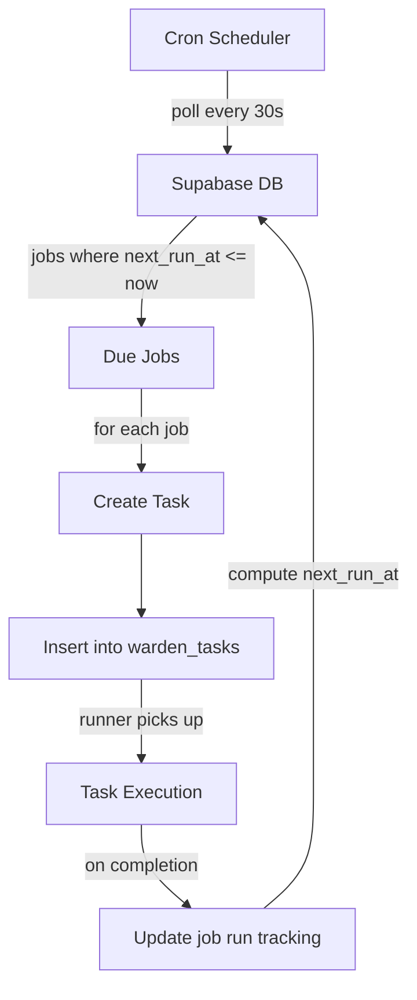

## Overview

Warden includes a built-in cron scheduler that polls the database every 30 seconds for due jobs. Cron jobs create tasks that execute just like manually submitted tasks, but on a schedule.

<Note>
  **Database-driven scheduling**: No external cron daemon required. All job definitions live in Supabase.
</Note>

## Scheduler Architecture



<Steps>
  <Step title="Scheduler polls">
    Every 30 seconds, query for jobs where `enabled = true` AND `next_run_at <= now()`
  </Step>
  
  <Step title="Create task">
    For each due job, insert a task with `metadata.cron = true`
  </Step>
  
  <Step title="Update job state">
    Increment `run_count`, set `last_run_at`, compute and set `next_run_at`
  </Step>
  
  <Step title="Handle one-shot jobs">
    If `schedule_type = 'at'` or `next_run_at` is null, disable or delete the job
  </Step>
</Steps>

## Schedule Types

Warden supports three types of schedules:

<Tabs>
  <Tab title="cron">
    ### Cron Expressions
    
    **Use case**: Recurring tasks with complex schedules (daily, weekly, monthly, etc.)
    
    **Format**: Standard 5-field cron syntax
    
    ```
    ┌───────────── minute (0 - 59)
    │ ┌───────────── hour (0 - 23)
    │ │ ┌───────────── day of month (1 - 31)
    │ │ │ ┌───────────── month (1 - 12)
    │ │ │ │ ┌───────────── day of week (0 - 6, Sunday = 0)
    │ │ │ │ │
    * * * * *
    ```
    
    **Examples**:
    
    | Expression | Description |
    |------------|-------------|
    | `0 9 * * *` | Daily at 9:00 AM |
    | `0 9 * * MON` | Every Monday at 9:00 AM |
    | `0 9,17 * * *` | Daily at 9:00 AM and 5:00 PM |
    | `*/15 * * * *` | Every 15 minutes |
    | `0 0 1 * *` | First day of every month at midnight |
    | `0 9 * * MON-FRI` | Weekdays at 9:00 AM |
    
    **Add job**:
    ```bash
    npx tsx src/cron-cli.ts add \
      --name "daily-content-scan" \
      --cron "0 8 * * *" \
      --tz "America/Los_Angeles" \
      --instruction "Scan HN, Reddit, and YouTube for trending AI topics"
    ```
    
    <Info>
      **Timezone support**: Specify `--tz` with an IANA timezone (e.g. `America/New_York`, `Europe/London`). Defaults to UTC.
    </Info>
  </Tab>
  
  <Tab title="at">
    ### One-Shot Reminders
    
    **Use case**: Fire once at a specific time (reminders, scheduled publishes)
    
    **Format**: ISO 8601 timestamp
    
    **Examples**:
    
    ```bash
    # Reminder in the future
    npx tsx src/cron-cli.ts add \
      --name "publish-blog-post" \
      --at "2026-03-15T14:00:00Z" \
      --instruction "Publish the draft post at /drafts/ai-agents.md to WordPress"
    
    # Same day reminder
    npx tsx src/cron-cli.ts add \
      --name "meeting-prep" \
      --at "2026-03-10T13:30:00-08:00" \
      --instruction "Send Telegram message: 'Meeting with V2Cloud in 30 minutes'"
    ```
    
    **Behavior**:
    - Job fires once when `next_run_at` is reached
    - Automatically disabled after firing (unless `--no-delete`)
    - `delete_after_run` defaults to `true` for `--at` jobs
    
    <Note>
      Use `--no-delete` if you want to keep the job record for audit purposes:
      ```bash
      npx tsx src/cron-cli.ts add \
        --name "one-time-import" \
        --at "2026-03-15T09:00:00Z" \
        --no-delete \
        --instruction "Import legacy content from old blog"
      ```
    </Note>
  </Tab>
  
  <Tab title="every">
    ### Fixed Intervals
    
    **Use case**: Simple repeating tasks (poll every N hours, check every N minutes)
    
    **Format**: Human-readable duration (e.g. `5m`, `2h`, `1d`)
    
    **Examples**:
    
    ```bash
    # Every 6 hours
    npx tsx src/cron-cli.ts add \
      --name "reddit-scan" \
      --every "6h" \
      --instruction "Scan r/LocalLLaMA and r/selfhosted for trending topics"
    
    # Every 30 minutes
    npx tsx src/cron-cli.ts add \
      --name "monitor-site" \
      --every "30m" \
      --instruction "Check if openclaws.blog is up and report any downtime"
    
    # Every 7 days
    npx tsx src/cron-cli.ts add \
      --name "weekly-summary" \
      --every "7d" \
      --instruction "Generate a weekly summary of blog performance"
    ```
    
    **Supported units**:
    - `m` = minutes
    - `h` = hours
    - `d` = days
    
    **Behavior**:
    - First run: immediately (on creation)
    - Subsequent runs: every N units after last run
    
    <Info>
      Intervals are calculated from `last_run_at`, not clock time. If a job takes 5 minutes to run and is set to `every 10m`, the next run will be ~15 minutes from the previous start.
    </Info>
  </Tab>
</Tabs>

## CLI Reference

### Add a Job

```bash
npx tsx src/cron-cli.ts add \
  --name "job-name" \
  --cron "0 9 * * *" \
  --tz "America/Los_Angeles" \
  --instruction "Task instruction" \
  --metadata '{"source":"telegram","chatId":123}' \
  --delete-after-run
```

**Flags**:

| Flag | Description | Required |
|------|-------------|----------|
| `--name` | Human-readable job name | ✅ |
| `--instruction` | Task instruction to execute | ✅ |
| `--cron <expr>` | Cron expression (e.g. `"0 9 * * *"`) | One of: `--cron`, `--at`, `--every` |
| `--at <time>` | ISO 8601 timestamp (e.g. `"2026-03-15T14:00:00Z"`) | One of: `--cron`, `--at`, `--every` |
| `--every <duration>` | Interval (e.g. `"6h"`, `"30m"`, `"7d"`) | One of: `--cron`, `--at`, `--every` |
| `--tz <timezone>` | IANA timezone (default: `UTC`) | ❌ |
| `--metadata <json>` | JSON metadata for created tasks | ❌ |
| `--delete-after-run` | Delete job after first run (default: `true` for `--at`) | ❌ |
| `--no-delete` | Keep job after run (opposite of `--delete-after-run`) | ❌ |

### List Jobs

```bash
npx tsx src/cron-cli.ts list
```

**Output**:
```
Cron Jobs (3 total)

ID: 550e8400-e29b-41d4-a716-446655440000
Name: daily-content-scan
Schedule: cron (0 8 * * *) in America/Los_Angeles
Enabled: true
Instruction: Scan HN, Reddit, and YouTube for trending AI topics
Last run: 2026-03-10T08:00:00Z (task: abc-123)
Next run: 2026-03-11T08:00:00Z
Run count: 45
---

ID: 660e8400-e29b-41d4-a716-446655440001
Name: weekly-summary
Schedule: every 7d
Enabled: true
Instruction: Generate a weekly summary of blog performance
Last run: 2026-03-03T12:00:00Z (task: def-456)
Next run: 2026-03-10T12:00:00Z
Run count: 12
---
```

### Get Job Details

```bash
npx tsx src/cron-cli.ts get <job-id>
```

### Update a Job

```bash
# Disable a job
npx tsx src/cron-cli.ts update <job-id> --enabled false

# Enable a job
npx tsx src/cron-cli.ts update <job-id> --enabled true

# Change schedule
npx tsx src/cron-cli.ts update <job-id> --cron "0 10 * * *"

# Change instruction
npx tsx src/cron-cli.ts update <job-id> --instruction "New task instruction"
```

### Delete a Job

```bash
npx tsx src/cron-cli.ts delete <job-id>
```

### Manually Trigger a Job

```bash
# Fire immediately (does not affect schedule)
npx tsx src/cron-cli.ts run <job-id>
```

<Info>
  `run` creates a task immediately without waiting for the next scheduled run. It does **not** update `last_run_at` or `next_run_at`.
</Info>

## Implementation Details

### Scheduler Loop

```typescript
// source/src/cron.ts:15
async function fireDueJobs(): Promise<void> {
  const dueJobs = await pollDueCronJobs();
  for (const job of dueJobs) {
    try {
      // Create a task from the cron job
      const task = await insertTask({
        instruction: job.instruction,
        metadata: { ...(job.task_metadata ?? {}), cron: true },
      });
      console.log(`[cron] Fired job "${job.name}" (${job.id}) → task ${task.id}`);

      // Compute next run time
      const nextRun = computeNextRun(job);

      // Update the job's run tracking
      await markCronJobRun(job.id, task.id, nextRun);

      // Handle one-shot jobs
      if (job.schedule_type === "at" || !nextRun) {
        if (job.delete_after_run) {
          await deleteCronJob(job.id);
        } else {
          await updateCronJob(job.id, { enabled: false });
        }
      }
    } catch (err) {
      console.error(`[cron] Error firing job ${job.id}:`, err);
    }
  }
}

// Poll every 30 seconds
setInterval(fireDueJobs, 30_000);
```

### Database Query

```typescript
// source/src/data_model/db.ts:243
export async function pollDueCronJobs(): Promise<CronJob[]> {
  const { data } = await getSupabase()
    .from("warden_cron_jobs")
    .select()
    .eq("enabled", true)
    .lte("next_run_at", new Date().toISOString())  // ← Due jobs only
    .order("next_run_at", { ascending: true });
  return data ?? [];
}
```

### Next Run Calculation

```typescript
// Pseudocode for computeNextRun()
function computeNextRun(job: CronJob): string | null {
  if (job.schedule_type === "cron") {
    // Use a cron parser library (e.g. cron-parser)
    const interval = parseExpression(job.cron_expression, {
      tz: job.cron_timezone
    });
    return interval.next().toISOString();
  }
  
  if (job.schedule_type === "every") {
    // Add interval to last_run_at
    return new Date(
      new Date(job.last_run_at).getTime() + job.every_ms
    ).toISOString();
  }
  
  if (job.schedule_type === "at") {
    // One-shot, no next run
    return null;
  }
}
```

## Metadata Inheritance

Cron jobs can specify `task_metadata` to control where task results are delivered:

```bash
# Route results to a Telegram chat
npx tsx src/cron-cli.ts add \
  --name "morning-briefing" \
  --cron "0 9 * * *" \
  --tz "America/Los_Angeles" \
  --metadata '{"source":"telegram","chatId":123456789}' \
  --instruction "Send a summary of overnight HN activity"
```

**Behavior**:
- Task created with `metadata = { source: "telegram", chatId: 123456789, cron: true }`
- When task completes, `notifyTaskComplete()` sees `metadata.source = "telegram"`
- Result is sent to Telegram chat `123456789`

<Info>
  **Auto-inheritance**: If you create a cron job from within a Telegram chat, the `chatId` is automatically inherited from the current task's metadata. No need to pass `--metadata` manually.
</Info>

### Auto-Inheritance Example

```
Telegram chat 123456789:
User: "Create a daily reminder to check HN at 9am PT"

Agent executes:
  npx tsx src/cron-cli.ts add \
    --name "daily-hn-check" \
    --cron "0 9 * * *" \
    --tz "America/Los_Angeles" \
    --instruction "Check HN for AI news and report top 3 stories"
    # No --metadata flag needed!

Result:
  Job created with task_metadata = {"source":"telegram","chatId":123456789}
  Daily results will be sent back to this Telegram chat
```

**How it works**:

```typescript
// source/src/runner.ts:96
if (task.metadata) {
  process.env.WARDEN_TASK_METADATA = JSON.stringify(task.metadata);
}

// Agent calls cron-cli.ts, which reads:
const inherited = process.env.WARDEN_TASK_METADATA
  ? JSON.parse(process.env.WARDEN_TASK_METADATA)
  : {};

const taskMetadata = { ...inherited, ...(explicitMetadata ?? {}) };
```

<Note>
  **Explicit metadata overrides inheritance**: If you pass `--metadata`, it will merge with (and override) the inherited metadata.
</Note>

## Use Cases

<Tabs>
  <Tab title="Content Pipeline">
    ### Automated Content Workflow
    
    **Goal**: Publish blog posts twice weekly, scan competitors daily
    
    ```bash
    # Daily scan for topic ideas
    npx tsx src/cron-cli.ts add \
      --name "daily-v2cloud-scan" \
      --cron "0 8 * * *" \
      --tz "America/Los_Angeles" \
      --instruction "Monitor V2Cloud site for content changes. Generate 1-2 complementary topic ideas for openclaws.blog."
    
    # Bi-weekly publishing
    npx tsx src/cron-cli.ts add \
      --name "biweekly-blog-publish" \
      --cron "0 9 * * WED,SUN" \
      --tz "America/Los_Angeles" \
      --instruction "Review recent topic ideas, pick the best one, write and publish a full blog post."
    ```
    
    **Flow**:
    1. Daily scan finds trending topics on partner site
    2. Bi-weekly job picks best topic and writes post
    3. Post published to WordPress automatically
  </Tab>
  
  <Tab title="Reminders">
    ### Personal Reminders
    
    **Goal**: Send Telegram reminders for recurring tasks
    
    ```bash
    # Daily walk reminder
    npx tsx src/cron-cli.ts add \
      --name "walk-reminder" \
      --cron "0 15 * * *" \
      --tz "America/Los_Angeles" \
      --metadata '{"source":"telegram","chatId":123456789}' \
      --instruction "Send Telegram message: '🐕 Time for Ting\'s walk!'"
    
    # Weekly planning
    npx tsx src/cron-cli.ts add \
      --name "weekly-planning" \
      --cron "0 9 * * MON" \
      --tz "America/Los_Angeles" \
      --metadata '{"source":"telegram","chatId":123456789}' \
      --instruction "Send Telegram message with this week\'s content goals"
    ```
  </Tab>
  
  <Tab title="Monitoring">
    ### Site Monitoring
    
    **Goal**: Check site health every 15 minutes, alert on downtime
    
    ```bash
    # Health check
    npx tsx src/cron-cli.ts add \
      --name "site-health-check" \
      --every "15m" \
      --instruction "Check if openclaws.blog is responding (curl -I). If down for >5 minutes, send Telegram alert."
    
    # Daily analytics
    npx tsx src/cron-cli.ts add \
      --name "daily-analytics" \
      --cron "0 8 * * *" \
      --tz "America/Los_Angeles" \
      --instruction "Fetch yesterday\'s page views from WordPress and report top 5 posts."
    ```
  </Tab>
  
  <Tab title="One-Shot Tasks">
    ### Scheduled Publishes
    
    **Goal**: Publish a specific post at a specific time
    
    ```bash
    # Publish draft next Wednesday
    npx tsx src/cron-cli.ts add \
      --name "publish-ai-agents-post" \
      --at "2026-03-15T09:00:00-08:00" \
      --instruction "Publish draft at /drafts/ai-agents-2026.md to WordPress with SEO optimization."
    
    # One-time data migration
    npx tsx src/cron-cli.ts add \
      --name "migrate-old-posts" \
      --at "2026-03-10T22:00:00Z" \
      --instruction "Import posts from /backups/old-blog.json and publish to WordPress."
    ```
  </Tab>
</Tabs>

## Best Practices

<Steps>
  <Step title="Make instructions self-contained">
    Cron jobs run with **no conversation history**. Include all context in the instruction:
    
    ❌ **Bad**:
    ```bash
    --instruction "Continue the scan from yesterday"
    ```
    
    ✅ **Good**:
    ```bash
    --instruction "Scan V2Cloud blog (v2cloud.com/blog) for posts modified in last 24h. Generate topic ideas for openclaws.blog."
    ```
  </Step>
  
  <Step title="Use timezones for user-facing times">
    Specify `--tz` for schedules tied to business hours or user expectations:
    
    ```bash
    # Publishes at 9am Pacific, even during DST changes
    --cron "0 9 * * *" --tz "America/Los_Angeles"
    ```
  </Step>
  
  <Step title="Route results with metadata">
    Use `--metadata` to control where results are sent:
    
    ```bash
    # Send to Telegram
    --metadata '{"source":"telegram","chatId":123}'
    
    # Mark as low-priority (custom field)
    --metadata '{"priority":"low"}'
    ```
  </Step>
  
  <Step title="Monitor job failures">
    Create a meta-job to check for failed tasks:
    
    ```bash
    npx tsx src/cron-cli.ts add \
      --name "check-failed-cron-tasks" \
      --cron "0 10 * * *" \
      --instruction "Query Supabase for tasks where status=failed and metadata.cron=true. Report any failures from the last 24h."
    ```
  </Step>
</Steps>

## Debugging

<Tabs>
  <Tab title="Check scheduler logs">
    ```bash
    # Watch live logs
    tail -f log.txt | grep '\[cron\]'
    
    # Recent fires
    grep 'Fired job' log.txt | tail -20
    
    # Errors
    grep '\[cron\] Error' log.txt
    ```
  </Tab>
  
  <Tab title="Inspect job state">
    ```bash
    # Get job details
    npx tsx src/cron-cli.ts get <job-id>
    
    # Check next run time
    npx tsx src/cron-cli.ts list | grep -A5 "<job-name>"
    
    # Query Supabase directly
    psql $SUPABASE_URL -c "SELECT * FROM warden_cron_jobs WHERE id = '<job-id>';"
    ```
  </Tab>
  
  <Tab title="Test job manually">
    ```bash
    # Fire immediately without affecting schedule
    npx tsx src/cron-cli.ts run <job-id>
    
    # Watch task execution
    tail -f log.txt | grep 'task <task-id>'
    ```
  </Tab>
</Tabs>

## Performance

<CardGroup cols={2}>
  <Card title="Latency" icon="clock">
    **~30-60 seconds** from due time to task creation
    
    - Scheduler polls every 30s
    - Tasks created and queued immediately
  </Card>
  
  <Card title="Capacity" icon="gauge-high">
    **Thousands of jobs** per instance
    
    - Polling query is indexed (`next_run_at`)
    - Only due jobs fetched each cycle
  </Card>
  
  <Card title="Reliability" icon="shield-check">
    **Crash-safe** with database persistence
    
    - Job state lives in Supabase
    - Missed runs caught on next poll
  </Card>
  
  <Card title="Precision" icon="crosshairs">
    **~30-second accuracy**
    
    - Poll interval: 30s
    - Fine for most use cases (content, monitoring)
    - Not suitable for sub-minute precision
  </Card>
</CardGroup>

<Info>
  **Scaling**: To increase precision or throughput, run multiple Warden instances. The scheduler handles concurrent firing gracefully (tasks are idempotent).
</Info>

## Next Steps

<CardGroup cols={2}>
  <Card title="Architecture" icon="sitemap" href="/concepts/architecture">
    Understand Warden's system design
  </Card>
  <Card title="Task Lifecycle" icon="rotate" href="/concepts/task-lifecycle">
    Deep dive into task states and transitions
  </Card>
</CardGroup>