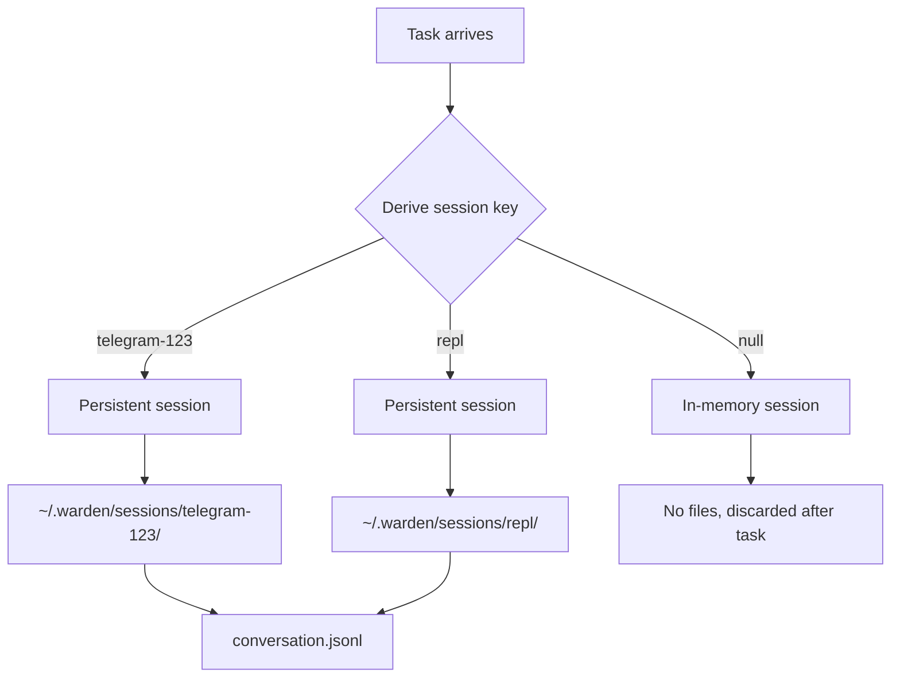

## Overview

Warden preserves conversation history across tasks for certain sources (Telegram chats, REPL) using **file-based SessionManagers**. Each persistent source gets its own session directory, allowing the agent to remember past interactions and maintain context.

<Note>
  **Key insight**: Not all tasks get persistent sessions. Cron jobs and API tasks are stateless by design.
</Note>

## Session Storage Architecture



### Session Types

<Tabs>
  <Tab title="Persistent Sessions">
    ### Persistent Sessions
    
    **Sources**:
    - Telegram chats (`telegram-<chatId>`)
    - REPL (`repl`)
    
    **Storage**: `~/.warden/sessions/<key>/conversation.jsonl`
    
    **Behavior**:
    - Conversation history loaded from disk on first task
    - Each turn appended to JSONL file
    - Context preserved across tasks indefinitely
    - Can be reset with `/new` command (Telegram/REPL)
    
    **Use case**: Interactive conversations where follow-up questions reference previous tasks.
    
    **Example**:
    ```
    User: "Check the HN frontpage"
    Agent: "Found 10 stories. Top one is about AI agents."
    
    [30 minutes later]
    
    User: "Write a blog post about that top story"
    Agent: [remembers "that" refers to the AI agents story]
    ```
  </Tab>
  
  <Tab title="Stateless Sessions">
    ### Stateless Sessions
    
    **Sources**:
    - Cron jobs (`metadata.cron = true`)
    - Tasks with no metadata
    
    **Storage**: In-memory only (no files)
    
    **Behavior**:
    - Fresh session created for each task
    - No conversation history loaded
    - Session discarded after task completes
    
    **Use case**: Scheduled tasks that should not depend on previous context.
    
    **Example**:
    ```typescript
    // Cron job fires daily
    {
      instruction: "Scan HN for AI news and post to blog",
      metadata: { cron: true }
    }
    
    // Each run is independent—no memory of yesterday's scan
    ```
  </Tab>
</Tabs>

## Session Key Derivation

The `deriveSessionKey()` function determines whether a task gets a persistent session:

```typescript
// source/src/session-store.ts:23
export function deriveSessionKey(
  metadata: Record<string, unknown> | null | undefined
): string | null {
  if (!metadata) return null;
  if (metadata.cron) return null; // cron tasks are stateless

  if (metadata.source === "telegram" && metadata.chatId != null) {
    return `telegram-${metadata.chatId}`;
  }
  if (metadata.source === "repl") {
    return "repl";
  }
  return null;
}
```

<Info>
  **Why cron jobs are stateless**: Recurring tasks should be idempotent and not depend on previous runs. If a cron job needs context, it should be explicitly passed in the instruction.
</Info>

## Session Creation and Caching

Warden caches sessions in memory to avoid recreating them for every task:

<Steps>
  <Step title="Check session cache">
    ```typescript
    // source/src/session-store.ts:56
    export async function getSessionForTask(
      task: Task,
      provider: string,
      modelId: string
    ): Promise<AgentSession> {
      const key = deriveSessionKey(task.metadata);

      // Stateless task — always create fresh in-memory session
      if (!key) {
        return buildSession(SessionManager.inMemory(), provider, modelId);
      }

      // Return cached session if available
      const cached = sessionCache.get(key);
      if (cached) {
        return cached;
      }

      // Create or resume a persistent session
      const sessionDir = path.join(SESSIONS_DIR, key);
      const sessionManager = SessionManager.continueRecent(
        process.cwd(),
        sessionDir
      );

      const session = await buildSession(sessionManager, provider, modelId);
      sessionCache.set(key, session);
      return session;
    }
    ```
  </Step>
  
  <Step title="Resume from disk (if exists)">
    ```typescript
    // pi-coding-agent SessionManager API
    const sessionManager = SessionManager.continueRecent(
      process.cwd(),
      sessionDir  // e.g. ~/.warden/sessions/telegram-123/
    );
    ```
    
    <Note>
      `continueRecent()` loads the most recent session from the JSONL file, or starts fresh if none exists.
    </Note>
  </Step>
  
  <Step title="Attach to task">
    ```typescript
    // source/src/runner.ts:92
    attachSubscriber(session);
    await session.prompt(task.instruction);
    ```
    
    The subscriber writes conversation updates to both:
    - **Database**: `conversation_history` table (crash recovery)
    - **Disk**: `~/.warden/sessions/<key>/conversation.jsonl` (long-term persistence)
  </Step>
</Steps>

## Session Reset

Users can reset a session to start fresh (useful after errors or topic changes):

### Telegram: `/new` Command

```typescript
// When user sends "/new"
const sessionKey = `telegram-${chatId}`;
markNewSession(sessionKey);

await ctx.reply(
  "Starting a new conversation. Previous context has been cleared."
);
```

### REPL: `/new` Command

```typescript
// When user types "/new"
markNewSession("repl");
console.log("New session started. Previous context cleared.");
```

### Implementation

```typescript
// source/src/session-store.ts:42
export function markNewSession(key: string): void {
  pendingResets.add(key);
}

// On next task from this source:
export async function getSessionForTask(...) {
  // ...
  if (pendingResets.has(key)) {
    pendingResets.delete(key);
    const old = sessionCache.get(key);
    sessionCache.delete(key);
    old?.dispose();  // Clean up old session
    freshAfterReset = true;
  }

  // Create fresh session (ignores old JSONL files)
  const sessionManager = freshAfterReset
    ? SessionManager.create(process.cwd(), sessionDir)
    : SessionManager.continueRecent(process.cwd(), sessionDir);
}
```

<Info>
  **Why defer disposal?** The old session might still be executing a task. We mark it for reset and dispose it when the next task arrives.
</Info>

## File Storage Format

Sessions are stored as **JSONL (JSON Lines)** files, one message per line:

```bash
~/.warden/sessions/
├── telegram-123456789/
│   └── conversation.jsonl
├── repl/
│   └── conversation.jsonl
└── telegram-987654321/
    └── conversation.jsonl
```

### conversation.jsonl Structure

```jsonl
{"role":"user","content":"Check the HN frontpage"}
{"role":"assistant","content":"I'll fetch the frontpage and look for top stories.","tool_calls":[{"id":"call_abc","name":"bash","args":{"command":"curl -s https://news.ycombinator.com"}}]}
{"role":"tool","tool_call_id":"call_abc","content":"<html>...</html>"}
{"role":"assistant","content":"Found 10 stories. Top one is about AI agents with 342 points."}
{"role":"user","content":"Write a blog post about that top story"}
{"role":"assistant","content":"I'll draft a post about AI agents based on the HN discussion."}
```

<Note>
  **Why JSONL?** It's append-only, human-readable, and easy to parse. Each line is a complete JSON object representing one message in the conversation.
</Note>

## Database vs. File Storage

Warden maintains conversation history in **two places** with different purposes:

<Tabs>
  <Tab title="Database (Supabase)">
    ### Database Storage
    
    **Table**: `warden_conversation_history`
    
    **Purpose**: Crash recovery for individual tasks
    
    **Updated**: After each agent turn (`turn_end` event)
    
    **Scope**: Per-task (not per-session)
    
    **Retention**: Overwritten on each turn (only latest state kept)
    
    ```sql
    CREATE TABLE warden_conversation_history (
      id bigint PRIMARY KEY,
      task_id uuid NOT NULL UNIQUE,  -- ← One row per task
      messages jsonb NOT NULL,
      updated_at timestamptz
    );
    ```
    
    **Use case**: If Warden crashes mid-task, the conversation state can be loaded from the database to resume.
    
    <Info>
      Currently, crash recovery is **not implemented**—stuck tasks are marked as failed. The database history is preserved for future implementation.
    </Info>
  </Tab>
  
  <Tab title="File Storage (JSONL)">
    ### File Storage
    
    **Location**: `~/.warden/sessions/<key>/conversation.jsonl`
    
    **Purpose**: Long-term conversation memory across tasks
    
    **Updated**: After each agent turn (managed by `SessionManager`)
    
    **Scope**: Per-session (spans multiple tasks)
    
    **Retention**: Append-only (full history preserved until `/new`)
    
    **Use case**: User sends follow-up question referencing a task from yesterday—agent loads full history and understands context.
    
    ```typescript
    // Loaded automatically by SessionManager.continueRecent()
    const sessionManager = SessionManager.continueRecent(
      process.cwd(),
      sessionDir
    );
    ```
  </Tab>
</Tabs>

## Session Lifecycle Example

Let's trace a Telegram conversation through multiple tasks:

<Steps>
  <Step title="First message">
    **User sends**: "Check HN for AI news"
    
    **Task created**:
    ```typescript
    {
      id: "task-001",
      instruction: "Check HN for AI news",
      metadata: { source: "telegram", chatId: 123 }
    }
    ```
    
    **Session resolution**:
    ```typescript
    deriveSessionKey({ source: "telegram", chatId: 123 })
    // → "telegram-123"
    
    // First time, so create new session
    SessionManager.continueRecent(
      process.cwd(),
      "~/.warden/sessions/telegram-123/"
    )
    // → Empty JSONL file created
    ```
  </Step>
  
  <Step title="Agent executes">
    Agent runs, conversation appended to JSONL:
    
    ```jsonl
    {"role":"user","content":"Check HN for AI news"}
    {"role":"assistant","content":"I'll check the frontpage..."}
    {"role":"tool","content":"..."}
    {"role":"assistant","content":"Found 3 AI stories. Top is about LangChain."}
    ```
    
    Task marked as `done`, session cached in memory.
  </Step>
  
  <Step title="Follow-up message (10 minutes later)">
    **User sends**: "Write a post about that LangChain story"
    
    **Task created**:
    ```typescript
    {
      id: "task-002",
      instruction: "Write a post about that LangChain story",
      metadata: { source: "telegram", chatId: 123 }
    }
    ```
    
    **Session resolution**:
    ```typescript
    deriveSessionKey({ source: "telegram", chatId: 123 })
    // → "telegram-123"
    
    // Session already cached, reuse it
    sessionCache.get("telegram-123")
    // → Returns existing AgentSession with full history
    ```
    
    **Agent sees full context**:
    - User's first message about checking HN
    - Agent's response listing AI stories
    - User's follow-up referencing "that LangChain story"
    
    Agent understands "that" refers to the top story from the previous task.
  </Step>
  
  <Step title="User resets session">
    **User sends**: `/new`
    
    **Handler**:
    ```typescript
    markNewSession("telegram-123");
    // → Adds "telegram-123" to pendingResets set
    ```
    
    **Next task**:
    ```typescript
    getSessionForTask(...)
    // → Detects pending reset
    // → Disposes old session
    // → Creates fresh session with empty history
    ```
  </Step>
</Steps>

## Session Isolation

Each session key gets its own isolated conversation:

```
~/.warden/sessions/
├── telegram-123/          ← Alice's Telegram chat
│   └── conversation.jsonl
├── telegram-456/          ← Bob's Telegram chat
│   └── conversation.jsonl
└── repl/                  ← Local REPL sessions
    └── conversation.jsonl
```

<Info>
  **Privacy**: Telegram users cannot see each other's conversation history. Each `chatId` gets a unique session directory.
</Info>

## Performance Considerations

<CardGroup cols={2}>
  <Card title="Memory Usage" icon="microchip">
    **~1-5 MB per active session**
    
    - Full conversation history in memory
    - Sessions cached until process restart
    - Use `/new` to free memory from long histories
  </Card>
  
  <Card title="Disk Usage" icon="hard-drive">
    **~1 KB per message**
    
    - JSONL files grow unbounded until `/new`
    - Typical conversation: 10-50 messages = 10-50 KB
    - Monitor `~/.warden/sessions/` directory size
  </Card>
  
  <Card title="Startup Time" icon="clock">
    **~100-500ms per session**
    
    - First task loads JSONL from disk
    - Subsequent tasks use cached session (instant)
  </Card>
  
  <Card title="Context Window" icon="arrows-left-right">
    **Limited by model**
    
    - Claude Sonnet 4: 200k tokens (~150k words)
    - Long histories truncated by SessionManager
    - Recent messages prioritized
  </Card>
</CardGroup>

<Note>
  **Context window management**: The `SessionManager` automatically truncates old messages when the conversation exceeds the model's context window, keeping the most recent turns.
</Note>

## Debugging Sessions

<Tabs>
  <Tab title="Inspect JSONL file">
    ```bash
    # View full conversation history
    cat ~/.warden/sessions/telegram-123/conversation.jsonl | jq .
    
    # Count messages
    wc -l ~/.warden/sessions/telegram-123/conversation.jsonl
    
    # Find specific tool calls
    grep '"tool_calls"' ~/.warden/sessions/repl/conversation.jsonl | jq .
    ```
  </Tab>
  
  <Tab title="List all sessions">
    ```bash
    # Find all session directories
    ls -lh ~/.warden/sessions/
    
    # Show session sizes
    du -sh ~/.warden/sessions/*
    
    # Find largest sessions
    du -sh ~/.warden/sessions/* | sort -rh | head -5
    ```
  </Tab>
  
  <Tab title="Clear session manually">
    ```bash
    # Delete a specific session
    rm -rf ~/.warden/sessions/telegram-123/
    
    # Clear all sessions
    rm -rf ~/.warden/sessions/*/
    
    # Warden will create fresh sessions on next task
    ```
  </Tab>
</Tabs>

## Best Practices

<Steps>
  <Step title="Use /new for topic changes">
    When switching to an unrelated topic, reset the session to avoid context pollution:
    
    ```
    User: "Check HN for crypto news"
    Agent: [finds stories]
    
    User: "/new"
    Agent: "New session started"
    
    User: "Write a blog post about AI agents"
    Agent: [doesn't confuse with crypto context]
    ```
  </Step>
  
  <Step title="Keep cron jobs stateless">
    Don't rely on conversation history in scheduled tasks:
    
    ❌ **Bad**: `"Continue the blog post from yesterday"`
    
    ✅ **Good**: `"Write a blog post about AI agents, following the style guide at /docs/style.md"`
  </Step>
  
  <Step title="Monitor session sizes">
    Large sessions can slow down the agent. Set up a cron job to alert on oversized sessions:
    
    ```bash
    npx tsx src/cron-cli.ts add \
      --name "session-size-check" \
      --cron "0 0 * * *" \
      --instruction "Check ~/.warden/sessions/ for files >5MB and report"
    ```
  </Step>
</Steps>

## Next Steps

<CardGroup cols={2}>
  <Card title="Task Lifecycle" icon="rotate" href="/concepts/task-lifecycle">
    Understand how tasks move through the system
  </Card>
  <Card title="Cron Scheduling" icon="calendar" href="/concepts/cron-scheduling">
    Schedule recurring tasks and one-shot reminders
  </Card>
</CardGroup>