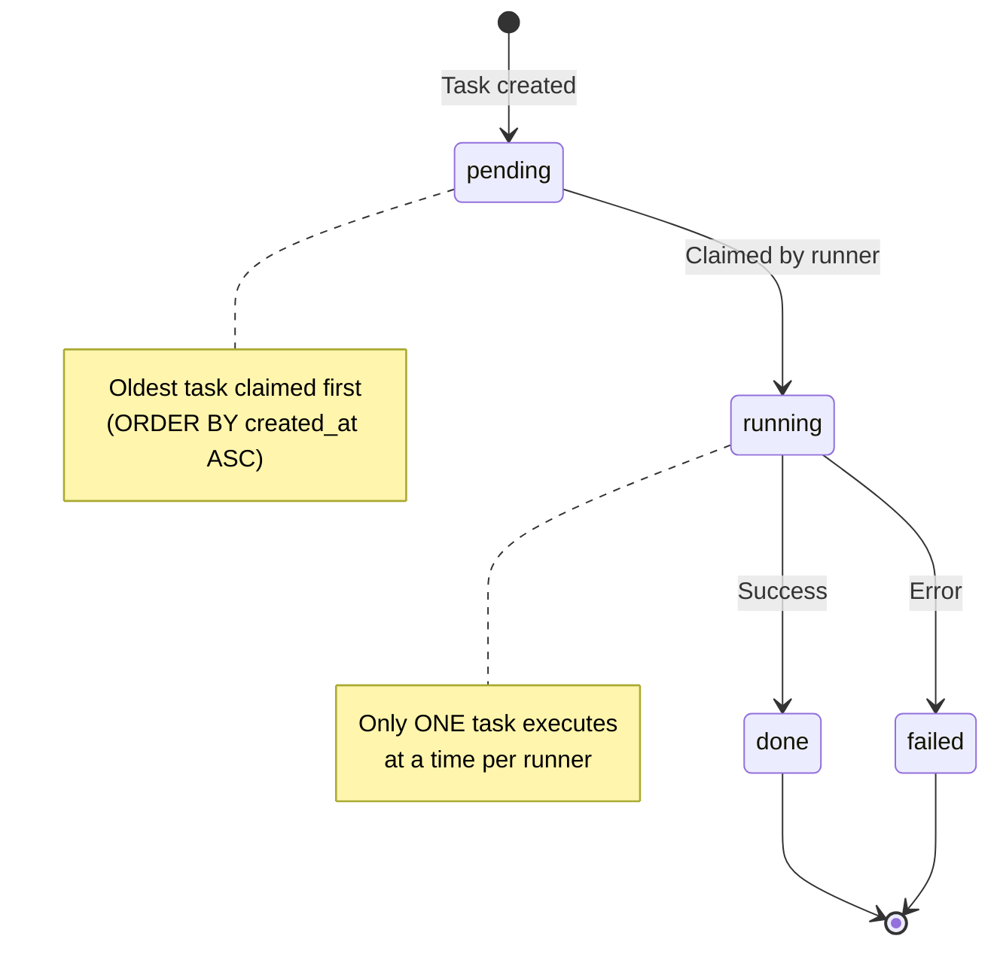
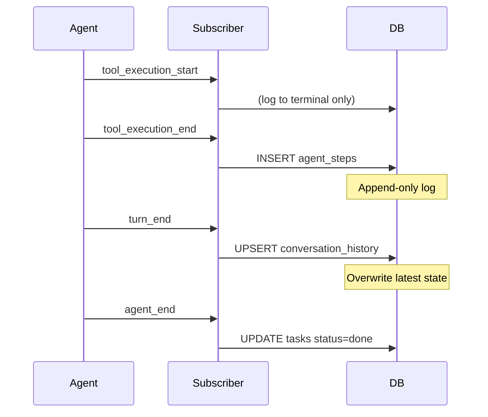

## Overview

Every task in Warden follows a predictable lifecycle: created as `pending`, claimed and marked `running`, then finalized as `done` or `failed`. The runner polls the database serially, ensuring tasks execute in creation order.

## State Machine



## Task States

<Tabs>
  <Tab title="pending">
    ### Pending
    
    **When**: Task is created but not yet claimed by a runner.
    
    **Database row**:
    ```typescript
    {
      id: "550e8400-e29b-41d4-a716-446655440000",
      instruction: "Write a blog post about AI agents",
      status: "pending",
      result: null,
      error: null,
      metadata: { source: "repl" },
      created_at: "2026-03-10T08:00:00Z",
      started_at: null,
      completed_at: null
    }
    ```
    
    **Next state**: `running` (when runner claims it)
    
    <Info>
      Tasks remain in `pending` indefinitely until a runner is available. If the runner crashes, pending tasks will be picked up when it restarts.
    </Info>
  </Tab>
  
  <Tab title="running">
    ### Running
    
    **When**: Runner has claimed the task and is executing the agent loop.
    
    **Database row**:
    ```typescript
    {
      id: "550e8400-e29b-41d4-a716-446655440000",
      instruction: "Write a blog post about AI agents",
      status: "running",
      result: null,
      error: null,
      metadata: { source: "repl" },
      created_at: "2026-03-10T08:00:00Z",
      started_at: "2026-03-10T08:00:02Z",  // ← Set when claimed
      completed_at: null
    }
    ```
    
    **Next state**: `done` or `failed`
    
    <Note>
      **Crash recovery**: If Warden crashes while a task is `running`, it will be marked as `failed` on restart with error `"Task was stuck in running state on startup"`.
    </Note>
    
    **Code reference**: `source/src/runner.ts:127`
    ```typescript
    const claimed = await claimTask(task.id);
    if (!claimed) return; // Another runner got it
    ```
  </Tab>
  
  <Tab title="done">
    ### Done
    
    **When**: Agent loop completed successfully.
    
    **Database row**:
    ```typescript
    {
      id: "550e8400-e29b-41d4-a716-446655440000",
      instruction: "Write a blog post about AI agents",
      status: "done",
      result: "Blog post created at /tmp/ai-agents-2026.md",  // ← Agent output
      error: null,
      metadata: { source: "repl" },
      created_at: "2026-03-10T08:00:00Z",
      started_at: "2026-03-10T08:00:02Z",
      completed_at: "2026-03-10T08:05:30Z"  // ← Set on completion
    }
    ```
    
    **Terminal state**: No further transitions.
    
    <Info>
      The `result` field contains all text output from the agent, collected from `message_update` events with `text_delta` payloads.
    </Info>
  </Tab>
  
  <Tab title="failed">
    ### Failed
    
    **When**: Agent loop threw an exception or task was stuck on startup.
    
    **Database row**:
    ```typescript
    {
      id: "550e8400-e29b-41d4-a716-446655440000",
      instruction: "Write a blog post about AI agents",
      status: "failed",
      result: null,
      error: "ENOENT: no such file or directory, open '/nonexistent.txt'",
      metadata: { source: "repl" },
      created_at: "2026-03-10T08:00:00Z",
      started_at: "2026-03-10T08:00:02Z",
      completed_at: "2026-03-10T08:00:15Z"
    }
    ```
    
    **Terminal state**: No further transitions.
    
    **Common failure reasons**:
    - Tool execution errors (file not found, permission denied)
    - LLM API errors (rate limits, timeouts)
    - Crash recovery (task stuck in `running` state)
  </Tab>
</Tabs>

## Task Creation

Tasks can be created from multiple sources:

<CardGroup cols={3}>
  <Card title="REPL" icon="terminal">
    Interactive command-line interface
    
    ```typescript
    // User types instruction
    const task = await insertTask({
      instruction: "Check HN frontpage",
      metadata: { source: "repl" }
    });
    ```
  </Card>
  
  <Card title="Cron Jobs" icon="clock">
    Scheduled recurring or one-shot tasks
    
    ```typescript
    // Scheduler fires due job
    const task = await insertTask({
      instruction: job.instruction,
      metadata: { 
        ...job.task_metadata,
        cron: true 
      }
    });
    ```
  </Card>
  
  <Card title="Telegram" icon="paper-plane">
    Messages sent to the Telegram bot
    
    ```typescript
    // Bot receives message
    const task = await insertTask({
      instruction: ctx.message.text,
      metadata: {
        source: "telegram",
        chatId: ctx.chat.id
      }
    });
    ```
  </Card>
</CardGroup>

### Task Metadata

The `metadata` field is a JSON object that flows through the task lifecycle:

```typescript
interface TaskMetadata {
  source?: "repl" | "telegram" | "api";  // Where task came from
  chatId?: number;                       // Telegram chat ID for replies
  cron?: boolean;                        // True if created by cron job
  [key: string]: unknown;                // Custom fields
}
```

<Info>
  **Session routing**: Metadata determines whether a task gets a persistent session (Telegram, REPL) or a stateless in-memory session (cron).
</Info>

## Polling and Claiming

The runner polls Supabase every **2 seconds** looking for pending tasks:

<Steps>
  <Step title="Poll for next task">
    ```typescript
    // source/src/data_model/db.ts:41
    export async function pollNextTask(): Promise<Task | null> {
      const { data, error } = await getSupabase()
        .from("warden_tasks")
        .select()
        .eq("status", "pending")
        .order("created_at", { ascending: true })  // ← Oldest first
        .limit(1)
        .maybeSingle();
      return data as Task | null;
    }
    ```
  </Step>
  
  <Step title="Attempt to claim">
    ```typescript
    // source/src/data_model/db.ts:53
    export async function claimTask(taskId: string): Promise<boolean> {
      const { data, error } = await getSupabase()
        .from("warden_tasks")
        .update({ 
          status: "running", 
          started_at: new Date().toISOString() 
        })
        .eq("id", taskId)
        .eq("status", "pending")  // ← Atomic: only claim if still pending
        .select()
        .maybeSingle();
      return data !== null;  // false if another runner claimed it
    }
    ```
    
    <Note>
      The `WHERE status = 'pending'` clause in the UPDATE makes claiming atomic—if two runners try to claim the same task, only one will succeed.
    </Note>
  </Step>
  
  <Step title="Execute task">
    ```typescript
    // source/src/runner.ts:79
    async function executeTask(task: Task, session: AgentSession) {
      const logger = createEventLogger(task.id);
      
      // Attach subscriber to log events
      attachSubscriber(session);
      
      try {
        // Run agent loop
        await session.prompt(task.instruction);
        
        // Collect output and mark done
        const result = ctx.assistantText || "(no output)";
        await completeTask(task.id, result);
      } catch (err) {
        // Mark failed
        await failTask(task.id, err.message);
      }
    }
    ```
  </Step>
</Steps>

<Info>
  **Serial execution**: The runner has an `executing` guard that prevents concurrent task execution. Only one task runs at a time per process.
</Info>

## Event Logging During Execution

While a task is `running`, the agent emits events that are logged to the database:



### Event → Database Mapping

| Event Type | DB Action | Table | Purpose |
|------------|-----------|-------|----------|
| `tool_execution_start` | None | — | Terminal logging only |
| `tool_execution_end` | INSERT | `agent_steps` | Full execution trace for debugging |
| `turn_end` | UPSERT | `conversation_history` | Crash recovery checkpoint |
| `message_update` | None | — | Collect streaming text output |
| `agent_end` | UPDATE | `tasks` | Mark status as `done` or `failed` |

<Tabs>
  <Tab title="agent_steps example">
    ```typescript
    // Logged on tool_execution_end
    {
      task_id: "550e8400-e29b-41d4-a716-446655440000",
      step_type: "tool_execution_end",
      tool_name: "bash",
      tool_args: {
        command: "curl -s https://news.ycombinator.com"
      },
      tool_result: "<html>...</html>",
      is_error: false,
      tokens_in: 1250,
      tokens_out: 85,
      cost_usd: 0.002134,
      created_at: "2026-03-10T08:00:05Z"
    }
    ```
  </Tab>
  
  <Tab title="conversation_history example">
    ```typescript
    // Upserted on turn_end
    {
      task_id: "550e8400-e29b-41d4-a716-446655440000",
      messages: [
        {
          role: "user",
          content: "Check the HN frontpage for AI news"
        },
        {
          role: "assistant",
          content: "I'll fetch the HN frontpage and look for AI-related stories.",
          tool_calls: [{ id: "call_abc", name: "bash", args: {...} }]
        },
        {
          role: "tool",
          tool_call_id: "call_abc",
          content: "<html>...</html>"
        },
        {
          role: "assistant",
          content: "Found 3 AI-related stories on the frontpage..."
        }
      ],
      updated_at: "2026-03-10T08:00:10Z"
    }
    ```
  </Tab>
</Tabs>

## Crash Recovery

When Warden starts, it checks for tasks stuck in `running` state:

```typescript
// source/src/runner.ts:146
export async function startRunner(
  provider: string,
  modelId: string
): Promise<void> {
  running = true;

  // Mark any tasks stuck in "running" as failed (from a previous crash)
  const failedCount = await failStuckTasks();
  if (failedCount > 0) {
    console.log(`[runner] Marked ${failedCount} stuck task(s) as failed`);
  }

  // Start polling
  setInterval(() => pollAndRun(provider, modelId), 2000);
}
```

<Note>
  **Why not resume?** Resuming requires loading conversation history and re-creating the exact session state, which is complex and error-prone. Marking as failed is simpler and more predictable.
</Note>

## Task Inspection

You can inspect task state from the REPL or by querying Supabase:

<Tabs>
  <Tab title="List active tasks">
    ```typescript
    // source/src/data_model/db.ts:89
    export async function listActiveTasks(): Promise<Task[]> {
      const { data } = await getSupabase()
        .from("warden_tasks")
        .select()
        .in("status", ["pending", "running"])
        .order("created_at", { ascending: true });
      return data ?? [];
    }
    ```
  </Tab>
  
  <Tab title="Get task by ID">
    ```typescript
    // source/src/data_model/db.ts:31
    export async function getTask(taskId: string): Promise<Task | null> {
      const { data } = await getSupabase()
        .from("warden_tasks")
        .select()
        .eq("id", taskId)
        .maybeSingle();
      return data as Task | null;
    }
    ```
  </Tab>
  
  <Tab title="Get execution log">
    ```typescript
    // source/src/data_model/db.ts:134
    export async function getStepsForTask(taskId: string): Promise<AgentStep[]> {
      const { data } = await getSupabase()
        .from("warden_agent_steps")
        .select()
        .eq("task_id", taskId)
        .order("created_at", { ascending: true });
      return data ?? [];
    }
    ```
  </Tab>
</Tabs>

## Performance Characteristics

<CardGroup cols={2}>
  <Card title="Latency" icon="gauge">
    **2-4 seconds** from task creation to execution start
    
    - Poll interval: 2s
    - Claim + session creation: ~1-2s
  </Card>
  
  <Card title="Throughput" icon="chart-line">
    **~30 tasks/hour** for typical tasks
    
    - Serial execution (one at a time)
    - Average task duration: 1-2 minutes
  </Card>
  
  <Card title="Reliability" icon="shield-check">
    **Crash-safe** with automatic recovery
    
    - Stuck tasks marked as failed on startup
    - Conversation history preserved per turn
  </Card>
  
  <Card title="Concurrency" icon="users">
    **Single-threaded** per runner
    
    - No parallel execution within one process
    - Can run multiple runners for horizontal scaling
  </Card>
</CardGroup>

<Info>
  **Scaling**: To increase throughput, run multiple Warden instances pointing to the same Supabase database. The atomic claim mechanism prevents duplicate execution.
</Info>

## Next Steps

<CardGroup cols={2}>
  <Card title="Session Persistence" icon="floppy-disk" href="/concepts/session-persistence">
    Learn how conversation history is preserved across tasks
  </Card>
  <Card title="Cron Scheduling" icon="calendar" href="/concepts/cron-scheduling">
    Schedule recurring tasks and one-shot reminders
  </Card>
</CardGroup>