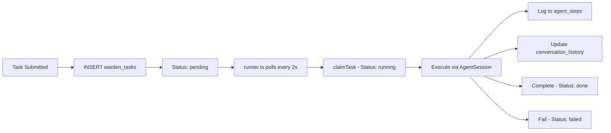

Warden uses **Supabase** as both the task queue and persistence layer. No external queue service is required — the database is the queue.

## Database Tables

Warden's schema includes four core tables:

1. **`warden_tasks`** — Task queue with status tracking
2. **`warden_agent_steps`** — Append-only event log per task
3. **`warden_conversation_history`** — Full message log for crash recovery
4. **`warden_cron_jobs`** — Scheduled job definitions

## warden_tasks

Central task queue. Each row represents a single task submitted via REPL, Telegram, or cron job.

```sql
create table warden_tasks (
  id uuid primary key default gen_random_uuid(),
  instruction text not null,
  status text not null default 'pending'
    check (status in ('pending', 'running', 'done', 'failed')),
  result text,
  error text,
  metadata jsonb,
  created_at timestamptz not null default now(),
  updated_at timestamptz not null default now(),
  started_at timestamptz,
  completed_at timestamptz
);

create index idx_warden_tasks_status 
  on warden_tasks (status, created_at asc);
```

From [001_initial_schema.sql:7-21](file:///home/daytona/workspace/source/supabase/migrations/001_initial_schema.sql:7).

### Task Statuses

<ParamField path="pending" type="status">
  Task is queued and waiting to be claimed by the runner
</ParamField>

<ParamField path="running" type="status">
  Task has been claimed and is currently executing
</ParamField>

<ParamField path="done" type="status">
  Task completed successfully. `result` field contains output.
</ParamField>

<ParamField path="failed" type="status">
  Task execution failed. `error` field contains error message.
</ParamField>

### Metadata Field

The `metadata` column (added in [002_add_task_metadata.sql](file:///home/daytona/workspace/source/supabase/migrations/002_add_task_metadata.sql)) is a JSONB field for integration context:

```json
{
  "source": "telegram",
  "chatId": 123456789,
  "messageId": 42
}
```

Used for routing task results back to the originating integration (e.g., sending Telegram replies).

<Note>
  Cron jobs can specify `task_metadata` that flows into created tasks. This enables scheduled tasks to be routed to specific integrations (e.g., daily summaries sent to Telegram).
</Note>

## warden_agent_steps

Append-only event log for all agent actions within a task. One row per tool execution, message update, or error.

```sql
create table warden_agent_steps (
  id bigint generated always as identity primary key,
  task_id uuid not null references warden_tasks(id) on delete cascade,
  step_type text not null,
  tool_name text,
  tool_args jsonb,
  tool_result text,
  is_error boolean not null default false,
  tokens_in int,
  tokens_out int,
  cost_usd numeric(10, 6),
  created_at timestamptz not null default now()
);

create index idx_warden_agent_steps_task_id 
  on warden_agent_steps (task_id, created_at asc);
```

From [001_initial_schema.sql:25-40](file:///home/daytona/workspace/source/supabase/migrations/001_initial_schema.sql:25).

### Step Types

Common `step_type` values:

- `tool_execution_start` — Agent begins executing a tool
- `tool_execution_end` — Tool execution completes
- `message_update` — Agent sends a text response
- `error` — Execution error (check `is_error` flag)

See [logger.ts](file:///home/daytona/workspace/source/src/logger.ts) for event mapping logic.

## warden_conversation_history

Full message log for each task. Used for crash recovery and session debugging.

```sql
create table warden_conversation_history (
  id bigint generated always as identity primary key,
  task_id uuid not null unique references warden_tasks(id) on delete cascade,
  messages jsonb not null default '[]',
  updated_at timestamptz not null default now()
);
```

From [001_initial_schema.sql:44-50](file:///home/daytona/workspace/source/supabase/migrations/001_initial_schema.sql:44).

The `messages` field stores the raw conversation array from `@mariozechner/pi-agent-core`, including system prompts, user messages, and assistant responses.

## warden_cron_jobs

Scheduled job definitions. The cron scheduler polls this table for due jobs and creates tasks in `warden_tasks`.

```sql
create table warden_cron_jobs (
  id uuid primary key default gen_random_uuid(),
  name text not null,
  enabled boolean not null default true,

  -- Schedule type: 'cron' (recurring), 'at' (one-shot), 'every' (interval)
  schedule_type text not null check (schedule_type in ('cron', 'at', 'every')),
  cron_expression text,        -- e.g. '0 9 * * *' (for schedule_type = 'cron')
  cron_timezone text not null default 'UTC',  -- IANA timezone
  at_time timestamptz,         -- one-shot fire time (for schedule_type = 'at')
  every_ms bigint,             -- interval in milliseconds (for schedule_type = 'every')

  instruction text not null,   -- task instruction to run
  task_metadata jsonb,         -- flows to created task (e.g. {source: "telegram", chatId: 123})

  last_run_at timestamptz,
  next_run_at timestamptz,
  last_task_id uuid references warden_tasks(id) on delete set null,
  run_count int not null default 0,

  delete_after_run boolean not null default false,

  created_at timestamptz not null default now(),
  updated_at timestamptz not null default now()
);

create index idx_warden_cron_jobs_next_run
  on warden_cron_jobs (next_run_at)
  where enabled = true;
```

From [003_add_cron_jobs.sql:4-34](file:///home/daytona/workspace/source/supabase/migrations/003_add_cron_jobs.sql:4).

### Schedule Types

<ParamField path="cron" type="schedule_type">
  Recurring schedule using cron expression (e.g., `0 9 * * *` for daily at 9am)
  
  **Fields used:** `cron_expression`, `cron_timezone`
</ParamField>

<ParamField path="at" type="schedule_type">
  One-shot execution at a specific time
  
  **Fields used:** `at_time`
  
  **Behavior:** Job is automatically deleted after execution (or marked disabled if `delete_after_run` is false)
</ParamField>

<ParamField path="every" type="schedule_type">
  Interval-based execution (e.g., every 5 minutes)
  
  **Fields used:** `every_ms`
</ParamField>

## Database Helpers

All database operations use typed helpers in [data_model/db.ts](file:///home/daytona/workspace/source/src/data_model/db.ts). Never use raw SQL.

### Task Operations

```typescript
import { insertTask, claimTask, completeTask, failTask } from "./data_model/index.js";

// Create a new task
const task = await insertTask({
  instruction: "Write a blog post about AI agents",
  metadata: { source: "telegram", chatId: 123 }
});

// Claim task for execution (atomic, prevents double-execution)
const claimed = await claimTask(task.id);
if (!claimed) {
  console.log("Task was already claimed by another runner");
}

// Mark task as complete
await completeTask(task.id, "Blog post published successfully");

// Or mark as failed
await failTask(task.id, "WordPress connection timeout");
```

From [db.ts:19-87](file:///home/daytona/workspace/source/src/data_model/db.ts:19).

### Agent Step Logging

```typescript
import { insertAgentStep } from "./data_model/index.js";

await insertAgentStep({
  task_id: task.id,
  step_type: "tool_execution_start",
  tool_name: "bash",
  tool_args: { command: "npm run build" },
  tool_result: null,
  is_error: false,
  tokens_in: null,
  tokens_out: null,
  cost_usd: null
});
```

From [db.ts:160-165](file:///home/daytona/workspace/source/src/data_model/db.ts:160).

### Conversation History

```typescript
import { upsertConversationHistory, getConversationHistory } from "./data_model/index.js";

// Save conversation snapshot
await upsertConversationHistory(task.id, [
  { role: "user", content: "Write a blog post" },
  { role: "assistant", content: "I'll help you write a blog post..." }
]);

// Retrieve for crash recovery
const messages = await getConversationHistory(task.id);
```

From [db.ts:169-192](file:///home/daytona/workspace/source/src/data_model/db.ts:169).

### Cron Job Management

```typescript
import { insertCronJob, updateCronJob, deleteCronJob } from "./data_model/index.js";

// Create daily job
const job = await insertCronJob({
  name: "daily-summary",
  schedule_type: "cron",
  cron_expression: "0 9 * * *",
  cron_timezone: "America/Los_Angeles",
  instruction: "Generate daily summary and send to Telegram",
  task_metadata: { source: "telegram", chatId: 123 }
});

// Disable job
await updateCronJob(job.id, { enabled: false });

// Delete job
await deleteCronJob(job.id);
```

From [db.ts:196-241](file:///home/daytona/workspace/source/src/data_model/db.ts:196).

## Migrations

Migrations live in `supabase/migrations/` and are numbered sequentially:

1. **001_initial_schema.sql** — Core tables (tasks, agent_steps, conversation_history)
2. **002_add_task_metadata.sql** — Adds `metadata` column to tasks
3. **003_add_cron_jobs.sql** — Adds cron job scheduling

<Warning>
  Run migrations in order via Supabase CLI:
  ```bash
  supabase db push
  ```
  
  Never modify existing migrations — create new ones for schema changes.
</Warning>

## Task Flow

The complete task lifecycle:



From [CLAUDE.md](file:///home/daytona/workspace/source/CLAUDE.md):

> Task submitted (REPL or Telegram) → INSERT into warden_tasks table (status: pending) → `runner.ts` polls & claims oldest pending → creates AgentSession → subscribes to events (writes agent_steps + conversation_history to DB each step) → `session.prompt()` runs full agent loop → marks task done/failed → sends Telegram reply if task came from Telegram → picks next pending.

## Polling Interval

The runner polls for pending tasks every **2 seconds**. See [runner.ts](file:///home/daytona/workspace/source/src/runner.ts) for implementation.

<Note>
  There is no webhook or push notification. The runner uses a simple polling loop:
  
  ```typescript
  while (running) {
    const task = await pollNextTask();
    if (task) await executeTask(task);
    await sleep(2000);
  }
  ```
</Note>

## Stuck Task Recovery

On startup, Warden fails any tasks stuck in `running` state (e.g., from a crash):

```typescript
export async function failStuckTasks(): Promise<number> {
  const { data, error } = await getSupabase()
    .from("warden_tasks")
    .update({
      status: "failed",
      error: "Task was stuck in running state on startup",
      completed_at: new Date().toISOString(),
    })
    .eq("status", "running")
    .select();
  if (error) throw error;
  return data?.length ?? 0;
}
```

From [db.ts:144-156](file:///home/daytona/workspace/source/src/data_model/db.ts:144).

## TypeScript Types

All database types are defined in [data_model/types.ts](file:///home/daytona/workspace/source/src/data_model/types.ts):

```typescript
export type TaskStatus = "pending" | "running" | "done" | "failed";

export interface Task {
  id: string;
  instruction: string;
  status: TaskStatus;
  result: string | null;
  error: string | null;
  metadata: Record<string, unknown> | null;
  created_at: string;
  updated_at: string;
  started_at: string | null;
  completed_at: string | null;
}

export interface TaskInput {
  instruction: string;
  metadata?: Record<string, unknown>;
}
```

From [types.ts:1-40](file:///home/daytona/workspace/source/src/data_model/types.ts:1).

## Supabase Client

The Supabase client is initialized lazily using environment variables:

```typescript
import { createClient, SupabaseClient } from "@supabase/supabase-js";

let client: SupabaseClient | null = null;

export function getSupabase(): SupabaseClient {
  if (client) return client;
  const url = process.env.SUPABASE_URL;
  const key = process.env.SUPABASE_ANON_KEY;
  if (!url || !key) {
    throw new Error("SUPABASE_URL and SUPABASE_ANON_KEY must be set");
  }
  client = createClient(url, key);
  return client;
}
```

From [db.ts:4-15](file:///home/daytona/workspace/source/src/data_model/db.ts:4).

<Warning>
  Always use `getSupabase()` to access the client. Never create a new client instance directly.
</Warning>