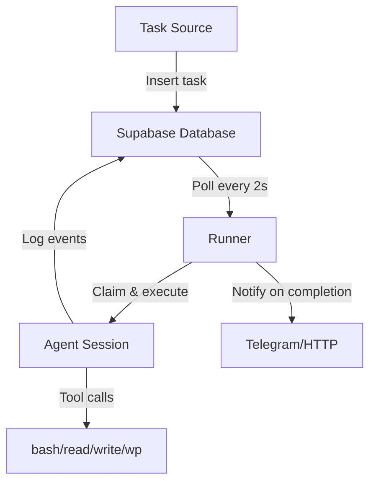

## What is Warden?

Warden is an autonomous CLI agent designed to run continuously on your local machine. It executes tasks by writing and running shell scripts, with a focus on automation workflows like content publishing, scheduled jobs, and remote control via Telegram.

<CardGroup cols={2}>
  <Card title="Quick Start" icon="rocket" href="/quickstart">
    Get Warden running in minutes with our step-by-step guide
  </Card>
  <Card title="Architecture" icon="sitemap" href="/concepts/architecture">
    Understand how Warden's task queue and agent loop work
  </Card>
  <Card title="Telegram Bot" icon="paper-plane" href="/interfaces/telegram">
    Control Warden remotely from your phone
  </Card>
  <Card title="Cron Scheduling" icon="clock" href="/concepts/cron-scheduling">
    Schedule recurring tasks with timezone support
  </Card>
</CardGroup>

## Key Features

<CardGroup cols={2}>
  <Card title="Supabase Task Queue" icon="database">
    No external queue service needed — your database is the queue. Tasks execute serially with full event logging.
  </Card>
  <Card title="Session Persistence" icon="floppy-disk">
    Conversations persist across tasks. Warden remembers context from previous interactions.
  </Card>
  <Card title="Multiple Interfaces" icon="layer-group">
    Submit tasks via Telegram, interactive REPL, or HTTP API. All routes feed the same queue.
  </Card>
  <Card title="WordPress Automation" icon="wordpress">
    Built-in wp-cli integration for publishing blog posts, managing media, and content workflows.
  </Card>
  <Card title="Skills System" icon="book-open">
    Load specialized prompt templates for content writing, SEO audits, and publishing workflows.
  </Card>
  <Card title="Crash Recovery" icon="arrows-rotate">
    If Warden crashes mid-task, it resumes from the last checkpoint using conversation history.
  </Card>
</CardGroup>

## How It Works

1. **Submit a task** — via Telegram, REPL, or HTTP API
2. **Runner claims it** — polls Supabase for the oldest pending task
3. **Agent executes** — uses LLM + built-in tools (bash, read, write, wp-cli)
4. **Events logged** — every tool call and result saved to database
5. **Results delivered** — sent back to original source (Telegram chat, HTTP response, etc.)

## Use Cases

<AccordionGroup>
  <Accordion title="Content Marketing Automation">
    Warden can monitor competitor sites, research trending topics, write SEO-optimized blog posts, and publish them to WordPress on a schedule.
  </Accordion>
  <Accordion title="Scheduled System Tasks">
    Run database backups, health checks, or cleanup scripts on a cron schedule with timezone support and error notifications via Telegram.
  </Accordion>
  <Accordion title="Remote CLI Access">
    Control your Mac Mini or local machine from anywhere via Telegram. Execute bash commands, check logs, or trigger deployments.
  </Accordion>
  <Accordion title="Developer Workflows">
    Automate code reviews, changelog generation, or release notes by connecting Warden to your git repositories.
  </Accordion>
</AccordionGroup>

## Next Steps

<CardGroup cols={3}>
  <Card title="Installation" icon="download" href="/installation">
    Set up Warden on your local machine
  </Card>
  <Card title="Configuration" icon="gear" href="/configuration/environment">
    Configure API keys and environment variables
  </Card>
  <Card title="Deploy with PM2" icon="server" href="/deployment/pm2">
    Run Warden 24/7 with auto-restart on boot
  </Card>
</CardGroup>
