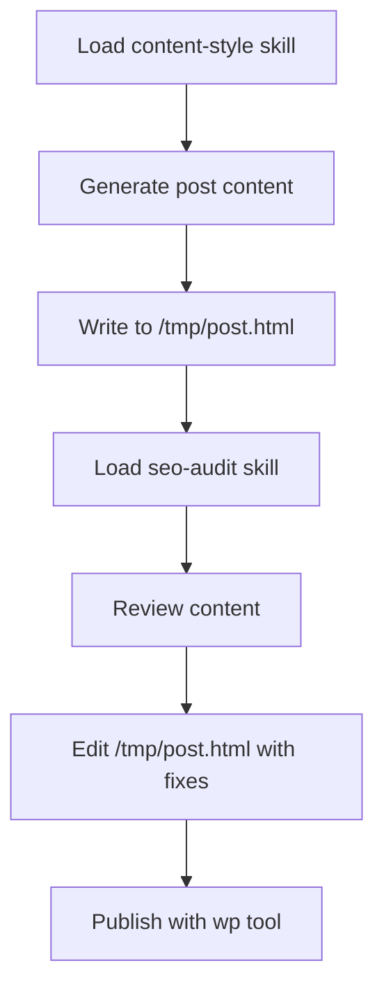

Warden provides three specialized tools for file operations: `read`, `write`, and `edit`. These tools integrate with the agent session to manipulate files during task execution.

## Available Tools

<CardGroup cols={3}>
  <Card title="read" icon="book-open">
    Read file contents into the agent context
  </Card>
  <Card title="write" icon="pen-to-square">
    Create new files or overwrite existing ones
  </Card>
  <Card title="edit" icon="scissors">
    Apply diff-style patches to existing files
  </Card>
</CardGroup>

## Read Tool

Reads file contents and makes them available to the agent for analysis or processing.

```typescript
// From src/prompt.ts
- read: Read file contents
```

### Use Cases

<Tabs>
  <Tab title="Configuration Files">
    Read configuration to understand current settings:
    
    ```bash
    # Example: Read package.json to check dependencies
    warden "Check if we have the latest version of pi-coding-agent"
    # Agent uses read tool to load package.json
    ```
  </Tab>
  
  <Tab title="Log Analysis">
    Parse log files for debugging:
    
    ```bash
    # Example: Analyze error logs
    warden "Check log.txt for errors in the last 24 hours"
    # Agent reads log.txt and filters by timestamp
    ```
  </Tab>
  
  <Tab title="Content Review">
    Review existing content before updating:
    
    ```bash
    # Example: Check blog post before publishing
    warden "Read draft.html and check it meets SEO guidelines"
    # Agent reads draft.html and applies SEO checklist
    ```
  </Tab>
</Tabs>

## Write Tool

Creates new files or completely replaces existing file contents.

```typescript
// From src/prompt.ts  
- write: Create or overwrite files
```

<Warning>
The write tool **overwrites** existing files without confirmation. Use the edit tool for safer modifications to existing files.
</Warning>

### Common Patterns

<AccordionGroup>
  <Accordion title="Generate HTML content for WordPress">
    From `CLAUDE.md:37-38`, Warden writes post content to temp files before publishing:
    
    ```typescript
    // Agent workflow:
    // 1. Use write tool to create /tmp/post.html
    // 2. Use wp tool to publish: wp post create /tmp/post.html
    ```
    
    This avoids shell escaping issues with long HTML strings.
  </Accordion>
  
  <Accordion title="Create configuration files">
    Generate config files programmatically:
    
    ```bash
    warden "Create a .env file with placeholders for all required variables"
    # Agent uses write tool to generate .env.example
    ```
  </Accordion>
  
  <Accordion title="Export structured data">
    Write JSON or CSV files:
    
    ```bash
    warden "Export the last 10 task results to tasks.json"
    # Agent queries Supabase and writes JSON file
    ```
  </Accordion>
</AccordionGroup>

## Edit Tool

Applies targeted changes to existing files using diff-style patches.

```typescript
// From src/prompt.ts
- edit: Apply diff-style patches to files
```

### When to Use Edit vs Write

<CodeGroup>
```typescript Edit - For targeted changes
// Update a specific section without rewriting the entire file
// Safer for files with complex formatting or multiple sections
// Preserves content you didn't intend to change

// Example: Update a function in a TypeScript file
edit("src/config.ts", {
  old: "timeout: 30000",
  new: "timeout: 60000"
})
```

```typescript Write - For complete replacements
// When you need to generate entire file contents
// For new files that don't exist yet
// When the entire file structure is changing

// Example: Generate a new configuration file
write(".env.example", `
SUPABASE_URL=your-project-url
SUPABASE_ANON_KEY=your-anon-key
ANTHROPIC_API_KEY=your-api-key
`)
```
</CodeGroup>

## Real-World Example: Blog Publishing Workflow

From the automated content workflow in `CLAUDE.md:152-168`, here's how file operations combine with other tools:



<Steps>
  <Step title="Generate content">
    Agent uses the `content-style` skill to write a 2,000-3,000 word blog post
  </Step>
  
  <Step title="Write to temp file">
    Use **write** tool to create `/tmp/post.html` with full HTML content
  </Step>
  
  <Step title="Run SEO audit">
    Load `seo-audit` skill to check on-page SEO requirements
  </Step>
  
  <Step title="Apply fixes">
    Use **edit** tool to update meta descriptions, heading structure, or internal links
  </Step>
  
  <Step title="Publish">
    Use `wp` tool to create WordPress post from the temp file
  </Step>
</Steps>

## Session Persistence

From `CLAUDE.md:52-53`, file operations benefit from session persistence:

```typescript
// From src/session-store.ts
// Uses SessionManager JSONL files in ~/.warden/sessions/
// for conversation continuity
```

This means:
- **Context is preserved** across tasks from the same source (Telegram chat, REPL)
- Agent remembers files it previously read or modified
- You can reference "the file we edited earlier" in subsequent tasks

<Note>
Use `/new` in REPL or send a fresh message to start a new session and clear context.
</Note>

## File Paths and Working Directory

Warden runs from its installation directory. File paths should be:
- **Absolute paths** for system files (`/tmp/post.html`, `/var/log/app.log`)
- **Relative to project root** for project files (`src/config.ts`, `package.json`)

```bash
# From CLAUDE.md:11-12
npm run dev 2>&1 | tee log.txt   # Logs to ./log.txt in project root
```

## Best Practices

<AccordionGroup>
  <Accordion title="Use temp files for processing">
    When working with large or complex data, use `/tmp/` for intermediate files:
    
    ```bash
    # Good: Process in stages
    1. Write raw data to /tmp/raw.json
    2. Transform with jq: jq '.items[]' /tmp/raw.json > /tmp/filtered.json  
    3. Read /tmp/filtered.json for final processing
    ```
  </Accordion>
  
  <Accordion title="Verify read before edit">
    Always read a file before editing to ensure you're working with current contents:
    
    ```typescript
    // Agent should:
    // 1. Read file to see current state
    // 2. Apply edit with specific old/new strings
    // 3. Verify edit succeeded
    ```
  </Accordion>
  
  <Accordion title="Use write for generated content">
    When creating content from scratch (blog posts, reports, HTML), use write tool:
    
    ```bash
    warden "Write a blog post about AI agents and save to draft.html"
    # Agent generates full HTML and writes it in one operation
    ```
  </Accordion>
</AccordionGroup>

## Integration with Other Tools

<CardGroup cols={2}>
  <Card title="Bash" icon="terminal" href="/tools/bash">
    Combine file operations with shell commands for powerful workflows
  </Card>
  <Card title="WordPress" icon="wordpress" href="/tools/wordpress">
    Write HTML files locally, then publish with wp-cli
  </Card>
</CardGroup>

## Troubleshooting

<AccordionGroup>
  <Accordion title="Edit tool reports 'file not found'">
    The edit tool requires the file to exist. Use write tool to create new files:
    
    ```bash
    # Wrong: Try to edit non-existent file
    edit("new-file.txt", {...})
    
    # Right: Write new file first
    write("new-file.txt", "Initial content")
    ```
  </Accordion>
  
  <Accordion title="Write overwrites important file">
    The write tool doesn't prompt for confirmation. Always:
    - Use read first to check if file exists
    - Prefer edit tool for modifications to existing files
    - Back up critical files before testing workflows
  </Accordion>
  
  <Accordion title="Can't find relative path">
    Verify you're running from the correct directory:
    
    ```bash
    # Check current directory
    pwd
    
    # List files to confirm location  
    ls -la
    ```
  </Accordion>
</AccordionGroup>

## Performance Considerations

- **Read tool** is fast for files under 1MB
- **Write tool** is efficient for any size
- **Edit tool** requires parsing full file content

For large files (logs, databases), consider:
- Using bash with `head`, `tail`, or `grep` for filtering
- Processing in chunks
- Writing results to temp files for incremental processing

## Related Documentation

<CardGroup cols={2}>
  <Card title="Skills System" icon="book-open" href="/skills/overview">
    Load specialized prompts for content workflows
  </Card>
  <Card title="Session Persistence" icon="floppy-disk" href="/concepts/session-persistence">
    How Warden remembers context across tasks
  </Card>
</CardGroup>
