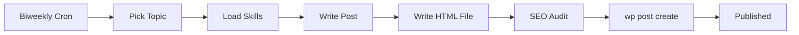

The WordPress tool (`wp`) provides a direct interface to wp-cli for blog publishing and content management. Warden uses this tool to power its automated content marketing workflows.

## Overview

From `src/wp-tool.ts`, the wp tool wraps wp-cli commands with SSH connection handling:

```typescript
// Tool definition
const wpTool: ToolDefinition = {
  name: "wp",
  label: "WordPress",
  description: "Execute wp-cli commands against the WordPress site configured via WP_SSH"
}
```

All commands execute over SSH to a remote WordPress installation configured via the `WP_SSH` environment variable.

## Configuration

Set up your WordPress connection in `.env`:

```bash
# From CLAUDE.md:128
WP_SSH=user@ssh.example.com
```

This should be your SSH connection string for the WordPress host. The tool automatically appends `--ssh="$WP_SSH"` to all wp-cli commands.

<Note>
wp-cli must be installed on both your local machine (where Warden runs) and the remote WordPress server. Warden uses the local wp-cli binary at `/opt/homebrew/bin/wp` to execute remote commands.
</Note>

## Common Commands

From `src/wp-tool.ts:21-32`, here are the most frequently used operations:

<Tabs>
  <Tab title="List Posts">
    Query posts with filtering:
    
    ```bash
    # List published posts
    wp post list --post_status=publish --fields=ID,post_title,post_date
    
    # List drafts
    wp post list --post_status=draft --fields=ID,post_title,post_date,post_status
    
    # Filter by date
    wp post list --post_status=publish --after="2026-01-01" --fields=ID,post_title
    ```
  </Tab>
  
  <Tab title="Create Posts">
    Publish new content:
    
    ```bash
    # Create draft from command line
    wp post create --post_title="My Post" --post_content="Body text" --post_status=draft --porcelain
    
    # Create from HTML file (recommended for long content)
    wp post create ./content.html --post_title="My Post" --post_status=publish --porcelain
    
    # Schedule for future publication
    wp post create ./content.html --post_title="Scheduled Post" --post_status=future --post_date="2026-03-20 09:00:00"
    ```
    
    <Note>
    Use `--porcelain` to return just the post ID, making it easy to capture for subsequent operations.
    </Note>
  </Tab>
  
  <Tab title="Update Posts">
    Modify existing posts:
    
    ```bash
    # Update title
    wp post update 123 --post_title="New Title"
    
    # Publish a draft
    wp post update 123 --post_status=publish
    
    # Update multiple fields
    wp post update 123 --post_title="Updated" --post_status=publish --post_date="2026-03-10 12:00:00"
    ```
  </Tab>
  
  <Tab title="Get Post Data">
    Retrieve specific post information:
    
    ```bash
    # Get post content
    wp post get 123 --field=post_content
    
    # Get post title  
    wp post get 123 --field=post_title
    
    # Get full post as JSON
    wp post get 123 --format=json
    ```
  </Tab>
  
  <Tab title="Delete Posts">
    Remove posts (careful!):
    
    ```bash
    # Move to trash
    wp post delete 123
    
    # Permanently delete
    wp post delete 123 --force
    
    # Delete multiple posts
    wp post delete 123 124 125
    ```
  </Tab>
  
  <Tab title="Media Management">
    Upload and manage images:
    
    ```bash
    # Upload image and set as featured
    wp media import ./image.jpg --post_id=123 --featured_image
    
    # Upload without attaching to post
    wp media import ./image.jpg --porcelain
    
    # List media
    wp media list --format=table
    ```
  </Tab>
</Tabs>

## Post Statuses

From `src/wp-tool.ts:31`, these statuses are available:

| Status | Description | Use Case |
|--------|-------------|----------|
| `draft` | Unpublished post | Work-in-progress content |
| `publish` | Live on the site | Published blog posts |
| `future` | Scheduled for later | Requires `--post_date` in the future |
| `pending` | Awaiting review | Editorial workflow |
| `private` | Published but hidden | Members-only content |

## Real-World Example: Automated Blog Publishing

From `CLAUDE.md:148-168`, here's how Warden uses the wp tool in production:



<Steps>
  <Step title="Cron job triggers">
    Every Wednesday and Sunday at 9am PT, the `biweekly-blog-publish` cron job runs
  </Step>
  
  <Step title="Content generation">
    Agent loads `content-style` skill and writes a 2,000-3,000 word blog post
  </Step>
  
  <Step title="Write to temp file">
    Post content is written to `/tmp/post-YYYYMMDD.html` to avoid shell escaping issues
  </Step>
  
  <Step title="SEO audit">
    Agent loads `seo-audit` skill and checks on-page SEO requirements
  </Step>
  
  <Step title="Publish to WordPress">
    Execute wp command:
    ```bash
    wp post create /tmp/post-YYYYMMDD.html \
      --post_title="Post Title" \
      --post_status=publish \
      --ssh="$WP_SSH" \
      --porcelain
    ```
  </Step>
  
  <Step title="Capture post ID">
    The `--porcelain` flag returns just the post ID for follow-up operations
  </Step>
</Steps>

<Warning>
From `CLAUDE.md:37-38`, always write post content to a temp file first:

```typescript
// Good: Write HTML to file, then pass file path
write("/tmp/post.html", postContent)
wp("post create /tmp/post.html --post_title='Title' --post_status=publish")

// Bad: Pass long HTML as command argument (causes shell escaping issues)
wp("post create --post_content='<html>...</html>' --post_title='Title'")
```
</Warning>

## WordPress Site Structure

From `CLAUDE.md:189-195`, Warden manages content on openclaws.blog:

| Page ID | Page | Purpose |
|---------|------|--------|
| 37 | Home | Hero headline, value propositions, latest posts |
| 1 | About | Blog mission, what we cover, our tools |
| 38 | Blog | Blog listing page |

```bash
# Update homepage hero
wp post update 37 --post_content="$(cat /tmp/new-hero.html)"

# List blog posts (page 38 shows these automatically)
wp post list --post_status=publish --order=DESC --orderby=date
```

## Tool Execution Details

From `src/wp-tool.ts:34-78`, the wp tool implementation:

```typescript
async execute(params) {
  const wpSsh = process.env.WP_SSH;
  if (!wpSsh) {
    return { error: "WP_SSH environment variable is not set" };
  }
  
  const fullCommand = `wp ${params.command} --ssh="${wpSsh}"`;
  const timeout = params.timeout ?? 30000; // 30 second default
  
  const output = execSync(fullCommand, {
    timeout,
    encoding: "utf-8",
    maxBuffer: 10 * 1024 * 1024,  // 10MB buffer for large responses
  });
  
  return output || "(no output)";
}
```

### Parameters

<ParamField path="command" type="string" required>
  wp-cli command without the leading "wp". Examples:
  - `post list --post_status=publish`
  - `post create ./content.html --post_title="Title"`
  - `media import ./image.jpg --featured_image`
</ParamField>

<ParamField path="timeout" type="number" default="30000">
  Command timeout in milliseconds. Increase for slow operations:
  ```bash
  # Large media upload might need longer timeout
  wp media import ./large-video.mp4 --timeout=120000
  ```
</ParamField>

## Error Handling

From `src/wp-tool.ts:63-77`, the tool captures both stdout and stderr:

```typescript
catch (err: any) {
  const stderr = err.stderr?.toString() ?? "";
  const stdout = err.stdout?.toString() ?? "";
  const message = stderr || stdout || err.message;
  
  return `wp command failed (exit ${err.status}):\n${message}`;
}
```

### Common Errors

<AccordionGroup>
  <Accordion title="WP_SSH not set">
    ```
    Error: WP_SSH environment variable is not set.
    ```
    
    **Fix**: Add `WP_SSH=user@host` to your `.env` file
  </Accordion>
  
  <Accordion title="SSH authentication failed">
    ```
    Permission denied (publickey).
    ```
    
    **Fix**: Ensure your SSH keys are set up correctly:
    ```bash
    # Test SSH connection
    ssh user@host
    
    # Add key if needed
    ssh-copy-id user@host
    ```
  </Accordion>
  
  <Accordion title="Post not found">
    ```
    Error: Invalid post ID.
    ```
    
    **Fix**: Verify the post ID exists:
    ```bash
    wp post list --fields=ID,post_title
    ```
  </Accordion>
  
  <Accordion title="Timeout on large operations">
    ```
    Error: command timed out after 30000ms
    ```
    
    **Fix**: Increase timeout for slow operations:
    ```typescript
    wp("media import large-file.mp4", { timeout: 120000 })
    ```
  </Accordion>
</AccordionGroup>

## Skills Integration

The wp tool integrates with Warden's skills system for complete workflows:

<CardGroup cols={2}>
  <Card title="content-style" icon="pen-fancy">
    Writing style guide, structure template, target audience rules
  </Card>
  <Card title="seo-audit" icon="magnifying-glass">
    On-page SEO checklist and keyword research workflow
  </Card>
  <Card title="publish" icon="upload">
    wp-cli reference, page IDs, site settings, and post-publish checklist
  </Card>
  <Card title="aeo-audit" icon="robot">
    Answer Engine Optimization for AI-generated answers (ChatGPT, Perplexity)
  </Card>
</CardGroup>

Load skills before executing WordPress workflows:

```bash
warden "Load the publish skill and create a new blog post about AI automation"
```

## Best Practices

<AccordionGroup>
  <Accordion title="Use porcelain for automation">
    When you need to capture post IDs or process output programmatically:
    
    ```bash
    # Returns just the ID: 789
    POST_ID=$(wp post create ./content.html --post_title="Test" --porcelain)
    
    # Returns verbose message
    wp post create ./content.html --post_title="Test"
    # Output: Success: Created post 789.
    ```
  </Accordion>
  
  <Accordion title="Write content to files first">
    From `CLAUDE.md:37-38`, avoid shell escaping issues:
    
    ```bash
    # Good
    echo "$HTML_CONTENT" > /tmp/post.html
    wp post create /tmp/post.html --post_title="Title"
    
    # Problematic
    wp post create --post_content="$HTML_CONTENT" --post_title="Title"
    ```
  </Accordion>
  
  <Accordion title="Test with drafts first">
    Always create drafts before publishing to production:
    
    ```bash
    # Create as draft
    POST_ID=$(wp post create ./content.html --post_title="Test" --post_status=draft --porcelain)
    
    # Review in WordPress admin
    # ...
    
    # Publish when ready
    wp post update $POST_ID --post_status=publish
    ```
  </Accordion>
  
  <Accordion title="Verify commands with list first">
    Check your targeting before destructive operations:
    
    ```bash
    # Check what you're about to delete
    wp post list --post_status=draft --fields=ID,post_title
    
    # Delete specific posts
    wp post delete 123 124 125
    ```
  </Accordion>
</AccordionGroup>

## Related Tools

<CardGroup cols={2}>
  <Card title="Bash Tool" icon="terminal" href="/tools/bash">
    Execute shell commands for file operations and processing
  </Card>
  <Card title="File Operations" icon="file" href="/tools/file-operations">
    Read/write/edit files for content generation
  </Card>
</CardGroup>

## External Resources

- [wp-cli Documentation](https://wp-cli.org/) — Official wp-cli reference
- [wp post command](https://developer.wordpress.org/cli/commands/post/) — Complete post management docs
- [wp media command](https://developer.wordpress.org/cli/commands/media/) — Media library operations
- [Homebrew wp-cli](https://formulae.brew.sh/formula/wp-cli) — Installation for macOS
